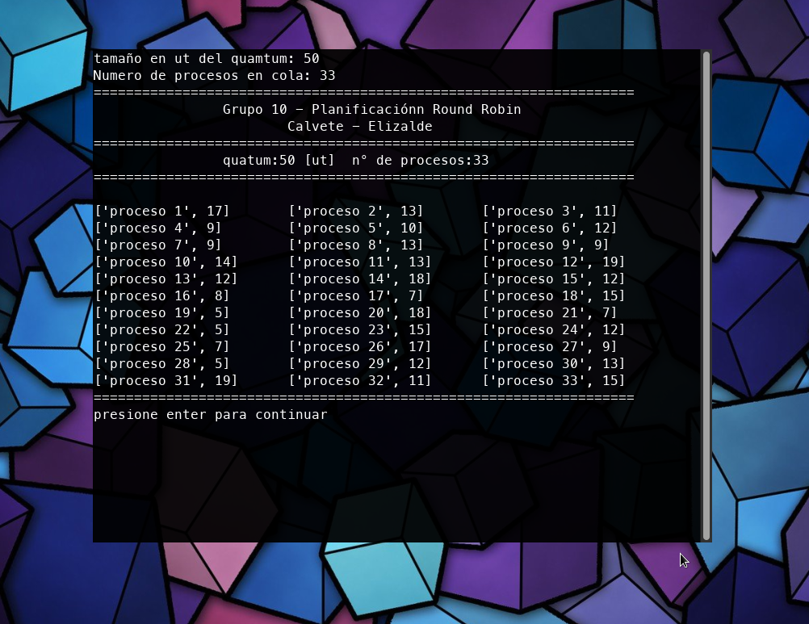
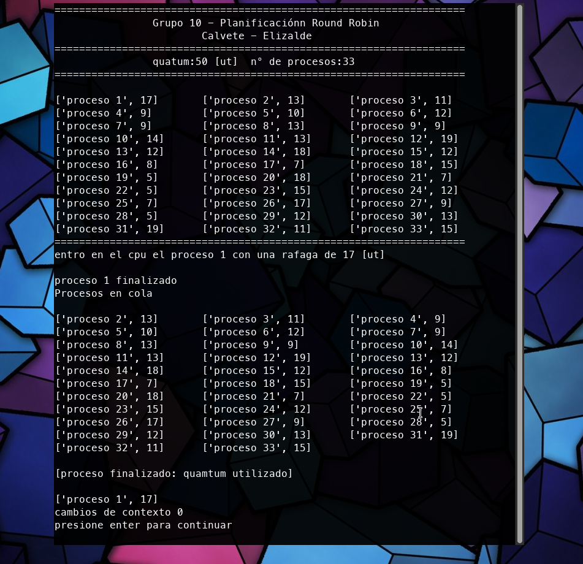
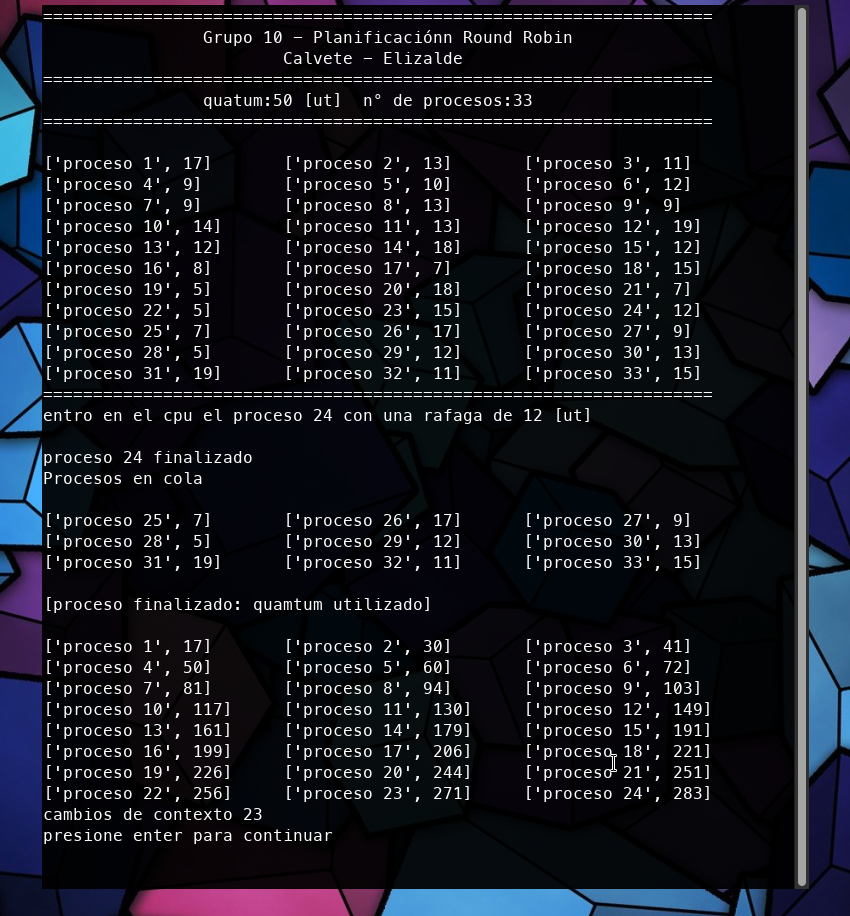
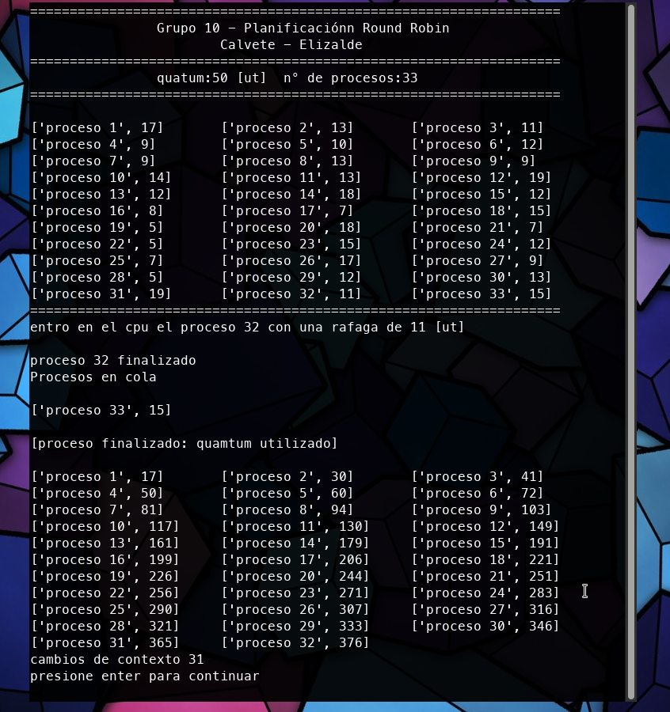

# Presentacion Projecto Arquitectura y Sistemas Operativos

## This is a simple implementation of the *Round Robin* algorithm in *python*
## as part of a project for the course Architecture and Operating Systems. 
## Below some screenshots of the algorithm running

